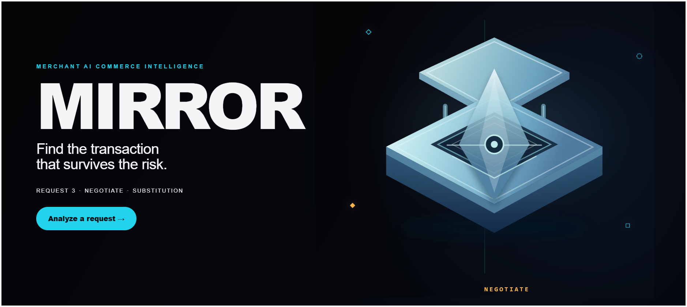
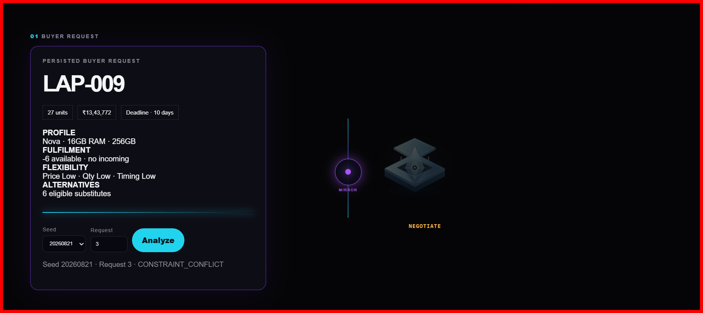
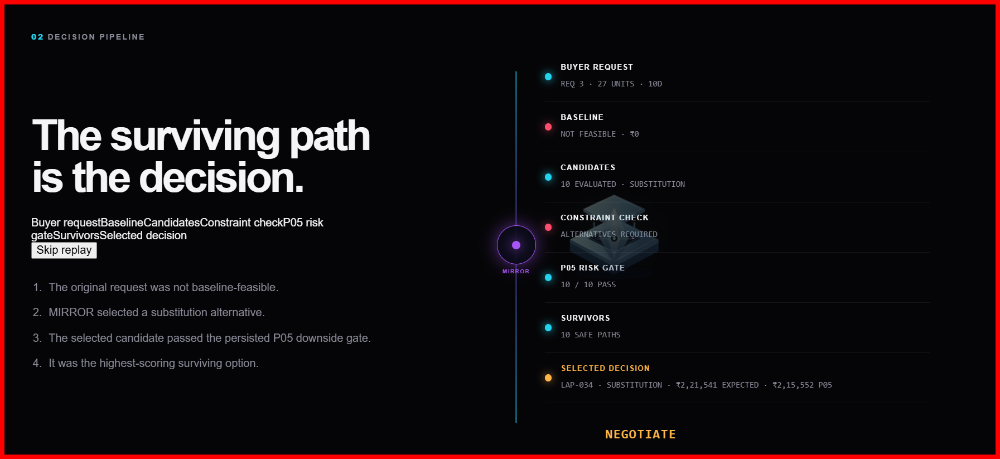
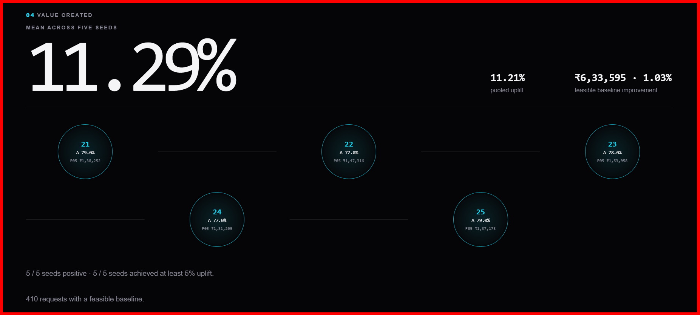
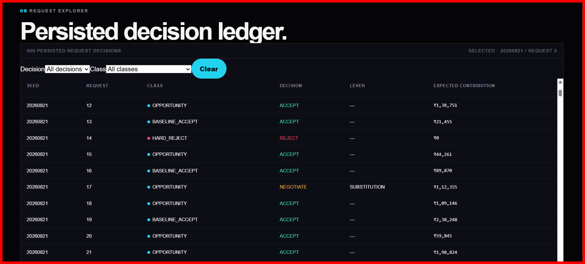

# MIRROR

### Merchant AI Commerce Intelligence

> **Find the transaction that survives the risk.**

MIRROR is a decision engine for commerce transactions under uncertainty. Instead of treating a buyer request as a simple accept/reject problem, MIRROR evaluates whether the transaction can be **accepted, recovered, negotiated, or safely declined** while protecting downside risk.

**Live demo:** https://mirror-rdqq.onrender.com/



## Why MIRROR exists

A commerce request can fail for many reasons: inventory constraints, timing, price pressure, or unacceptable downside. MIRROR searches the space of legitimate alternatives and keeps only candidates that survive the persisted downside-risk gate.

The system is built around a simple principle:

> **Story can be expressive. Evidence must remain real.**

Visual states and displayed metrics are driven by persisted experiment records and their actual fields rather than fabricated AI narratives.

## The core idea

For every buyer request, MIRROR follows the same decision path:

```text
BUYER REQUEST
      │
      ▼
┌───────────────────┐
│ BASELINE EVALUATION│
└─────────┬─────────┘
          │
          │ feasible baseline
          │        └──────────────► ACCEPT
          │
          │ pressure / conflict
          ▼
┌──────────────────────┐
│ CANDIDATE GENERATION │
│ price / substitution  │
│ quantity / timing     │
└──────────┬───────────┘
           ▼
┌──────────────────────┐
│ MONTE CARLO / P05    │
│ downside-risk gate   │
└──────────┬───────────┘
           ▼
┌──────────────────────┐
│ SAFE SURVIVORS       │
│ risk-gate-passing    │
│ alternatives         │
└──────────┬───────────┘
           ▼
     DECISION
    /    |     \
 ACCEPT NEGOTIATE REJECT
             │
             ▼
      PAYMENT BOUNDARY
```

### Decision states

| Decision | Meaning |
| --- | --- |
| **ACCEPT** | The baseline remains the safest selected transaction; no alternative wins under the decision rule. |
| **NEGOTIATE** | A risk-gate-passing alternative beats the baseline under the decision rule. |
| **REJECT** | No candidate satisfies the persisted decision rule, so MIRROR recommends no safe deal. |

## Locked experiment evidence

The dashboard is backed by a deterministic, persisted five-seed experiment rather than live/randomly changing numbers.

- **500** persisted buyer requests across five deterministic seeds
- **4,108** total candidates evaluated
- **3,698** negotiation/alternative candidates enter the P05 aggregate shown in the dashboard
- **2,477** of those candidates fail the P05 risk gate
- **1,221** survive the P05 gate
- **390 ACCEPT** decisions
- **55 NEGOTIATE** decisions
- **55 REJECT** decisions
- **35 / 45** constraint-conflict requests rescued (**77.78%**)

The five-seed headline is reported as **mean uplift versus the persisted baseline reference**. It is not presented as guaranteed profit or production ROI.

## Dashboard sections

The web interface turns the decision engine into an inspectable story rather than a conventional SaaS dashboard.

### 01 — Buyer Request

Shows the persisted request, quantity, budget/price, deadline, inventory, flexibility and eligible alternatives before MIRROR evaluates it.



### 02 — Decision Pipeline

Shows the reasoning path from buyer request → baseline → candidate evaluation → constraint check → P05 risk gate → survivors → selected decision.



### 03 — Experimental ML Safety Gate

The ML layer is an **experimental second safety signal**, not the transaction-selection authority. It sits beside MIRROR's deterministic P05 gate.

Persisted ML evidence:

- model: `sla-logreg-v1-seed-20260825`
- 20,000 held-out synthetic rows
- precision: **65.64%**
- recall: **99.90%**
- F1: **79.23%**
- end-to-end impact: **2 / 500 decisions changed (0.4%)**
- expected contribution change: **-0.84%**
- P05 change: **-0.59%**

The ML experiment therefore does **not** claim a profit increase. Its demonstrated role is additional SLA-risk filtering evidence.


### ML demo cases

The dashboard contains persisted examples showing what the experimental ML layer can change:

1. **Risk caught:** an existing NEGOTIATE decision is rejected by the experimental ML safety check when predicted SLA-miss risk is high.
2. **Safer alternative:** an existing substitution is replaced by a price alternative after the ML check. The safer outcome comes with a lower expected contribution, so both old and new values are displayed.

These cases are synthetic benchmark evidence, not production outcomes.

### 04 — Selected Transaction

Shows the actual candidate selected by MIRROR after the persisted P05 downside gate. For NEGOTIATE, this includes the selected alternative's expected contribution and P05.

### 05 — Performance vs Baseline

Reports the five-seed performance comparison. The headline is explicitly **mean uplift across five seeds**, avoiding the misleading implication that the percentage is guaranteed profit.



### 06 — Constraint Recovery

Measures how often MIRROR recovers a usable deal when the original request conflicts with constraints.

Locked evidence: **35 recovered out of 45 constraint-conflict requests = 77.78% rescue rate.**

### 07 — P05 Risk Protection

Shows how candidate alternatives are filtered by the persisted downside-risk gate:

```text
ALTERNATIVES → P05 GATE → SAFE SURVIVORS → SELECTED
```

For the dashboard aggregate, **2,477 candidates fail** the P05 gate and **1,221 survive**. The selected transaction is shown only when a real safe candidate exists; a REJECT is represented as **NO SAFE DEAL / NO-DEAL P05**, not as a fake selected transaction.

### 08 — Negotiation Levers

Shows which type of intervention most often produced a safe surviving deal in the selected evidence set:

- Substitution: **39 (70.9%)**
- Quantity: **15 (27.3%)**
- Timing: **1 (1.8%)**
- Price: **0 (0.0%)**

The chart is descriptive of the persisted selected-lever evidence; it does not mean substitution is universally optimal for every request.

### 09 — Request Explorer

Exposes the persisted request/decision ledger so individual ACCEPT, NEGOTIATE and REJECT decisions can be inspected instead of hiding everything behind aggregate numbers.



### 10 — Execution Boundary

Razorpay is deliberately separated from the decision engine. MIRROR can recommend a transaction without pretending that a payment happened. Order creation is server-side, credentials are test-mode only, and payment signatures are verified server-side.

## Evidence architecture

MIRROR separates deterministic decision authority from experimental ML evidence:

```text
                         BUYER REQUEST
                              │
                              ▼
                     DETERMINISTIC ENGINE
                              │
                ┌─────────────┴─────────────┐
                │                           │
          candidate search            constraint check
                │                           │
                └─────────────┬─────────────┘
                              ▼
                         MONTE CARLO
                              │
                              ▼
                           P05 GATE
                              │
                              ▼
                       SAFE SURVIVORS
                              │
                              ▼
                    FINAL DECISION AUTHORITY
                              │
               ┌──────────────┼──────────────┐
               ▼              ▼              ▼
            ACCEPT        NEGOTIATE        REJECT
                              │
                              ▼
                       PAYMENT BOUNDARY

             EXPERIMENTAL ML SAFETY SIGNAL
                       ───────────────►
                 evidence / extra filter
                 NOT the final authority
```

## Architecture

```text
                    ┌────────────────────────┐
                    │     MIRROR FRONTEND     │
                    │ HTML / CSS / JS / SVG   │
                    └───────────┬────────────┘
                                │ /dashboard/*
                                ▼
                    ┌────────────────────────┐
                    │       FASTAPI          │
                    │ persisted API surface  │
                    └───────────┬────────────┘
                                │
             ┌──────────────────┼──────────────────┐
             ▼                  ▼                  ▼
      ┌─────────────┐   ┌──────────────┐   ┌──────────────┐
      │ buyer data  │   │ experiments  │   │ decision /   │
      │ CSV         │   │ JSON records │   │ payment flow │
      └─────────────┘   └──────────────┘   └──────┬───────┘
                                                   │
                                                   ▼
                                           Razorpay Test Mode
```

### Frontend

The frontend lives under `frontened/` and includes the cinematic intro, MIRROR visual system, decision-pipeline visualization, ML evidence section, request explorer and execution boundary.

### Backend

`backend/main.py` serves the dashboard APIs and static UI surface. Persisted experiment artifacts are loaded from `experiments/` and buyer-request records from `data/`.

### Payment boundary

Razorpay order creation is server-side and only available when test credentials are configured. Selected negotiation candidates are validated against persisted records before an order can be created, and payment signatures are verified server-side.

## Project structure

```text
MIRROR/
├── backend/
│   ├── main.py
│   └── test_dashboard.py
├── data/
│   ├── Buyer-request.png
│   ├── dashboard.png
│   ├── decision-pipeline.png
│   ├── request-explorer.png
│   └── value-created.png
├── experiments/
│   ├── persisted seed results
│   ├── five-seed summary
│   └── experiment analysis
├── frontened/
│   ├── index.html
│   ├── app.js
│   ├── app.css
│   ├── tokens.css
│   ├── intelligence-core.js
│   ├── intelligence-core.css
│   ├── decision-pipeline.js
│   ├── decision-pipeline.css
│   ├── core-overrides.css
│   ├── cinematic-intro.css
│   └── assets/
│       ├── mirror-vessel.svg
│       └── MIRROR — Commerce Decision Engine_processed.mp4
├── docs/
│   └── FINAL_DEMO_QA.md
└── README.md
```

## Run locally

### 1. Create / activate the virtual environment

```powershell
python -m venv venv
.\venv\Scripts\Activate.ps1
```

### 2. Install dependencies

If `requirements.txt` is present:

```powershell
pip install -r requirements.txt
```

### 3. Start MIRROR

```powershell
python backend/main.py
```

Then open the local UI at the port configured by the backend, for example:

```text
http://127.0.0.1:8002/
```

The backend also exposes `/health` for a basic service check.

## Payment configuration

Razorpay is intentionally treated as an execution boundary rather than as part of the decision engine.

Set test credentials in the server environment when payment testing is required:

```text
RAZORPAY_KEY_ID=...
RAZORPAY_KEY_SECRET=...
```

Never commit credentials to the repository.

When credentials are absent, the interface should remain truthful and show the disabled/no-credentials state rather than pretending a payment succeeded.

## Validation and demo QA

The dashboard has been checked across desktop and mobile compositions, including:

- 1440×900
- 1280×720
- 768×720
- 390×844

Key regression areas:

- 10 dashboard sections
- 500 persisted explorer rows
- ACCEPT / NEGOTIATE / REJECT states
- P05 gate and selected-P05 semantics
- persisted-data bindings
- ML evidence and demo cases
- constraint recovery
- negotiation-lever aggregates
- no horizontal overflow
- cinematic intro handoff
- reduced-motion behavior
- Razorpay disabled-state behavior

A final deployed-browser smoke test is required before recording the demo. The detailed checklist is in `docs/FINAL_DEMO_QA.md`.

## Important limitations

1. The experiment data is **synthetic and locked**; it is not real merchant production traffic.
2. The ML panel is **persisted experimental evidence**, not production-validated ML performance.
3. The deterministic P05 engine remains the **transaction-selection authority**.
4. The ML experiment currently does **not** demonstrate a profit increase.
5. Remote CI status and final deployed-browser behavior must be verified independently before claiming the demo is fully validated.

## Status

**Active build — `mirror-visual-redesign`**

Current milestones:

- Persisted experiment-backed dashboard APIs
- Deterministic candidate evaluation and P05 downside gate
- Five-seed evidence-backed performance reporting
- Data-driven decision pipeline
- Constraint recovery analysis
- Negotiation-lever analysis
- Experimental ML SLA-risk safety layer
- ML persisted demo cases
- MIRROR vessel visual system
- Cinematic opening sequence
- Responsive dashboard refinement
- Razorpay test-mode execution boundary
- Final demo QA checkpoint

## Repository

MIRROR on GitHub: https://github.com/SHIVAIN-MITTAL16/MIRROR
